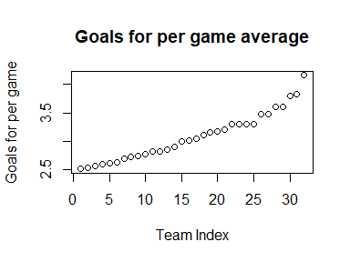
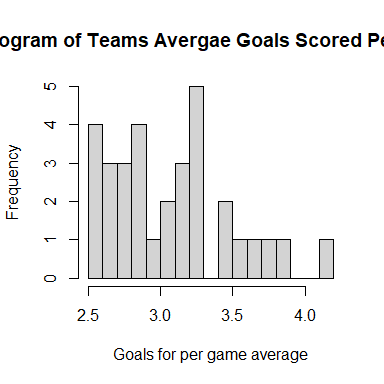
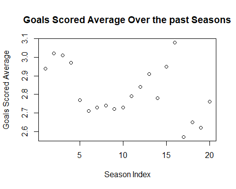
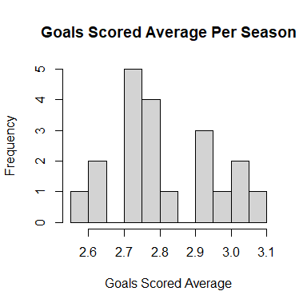

# Introduction

## What

This project is looking at the relationship between this season’s
National Hockey League scoring average statistics ad that of years’
past. It will also be taking a look at relationships between teams and
specifically determining if the Western conference teams score lower, on
average, compared to the Eastern conference teams.

## Why

There has been much discussion this year within the media and throughout
fans of the NHL that scoring is up, comparatively speaking, to past
years. To the naked eye, and those following the league on a nightly
basis, this seems to be true. Therefore, I want to determine statistical
significance of this observation, in order to verify if the league is
having an outstandingly high scoring average season.

The second topic I want to cover is one of the relationship of goal
scoring between conferences. In the past, the Western conference has
been seen as a much more tight-checking, heavy brand of hockey compared
to the Eastern conference, therefore creating lower scoring games. This
put up the reputation of there being less of an emphasis on defense in
the East, causing the average goals scored to be higher. I want to prove
if this theory holds true for this years goal-scoring statistics,
meaning if the Western conference is indeed still lower-scoring than the
Eastern conference.

## How

I have collected data and split them into two separate CSV files
initially created in Excel workbooks. One file consists the seasons
information, columns including the years, goals for average, and games
played (all teams combined) in each season. In the second file columns
such as Team name, games played (as of 4/7/22) goals for per game
average per team, and the conference of each team are accumulated named
Teams. I will then load these files in to RStudio, using the readr
package. I will then create plots and basic summary statistics in order
to describe the data, visualize trends, and help understand what we will
be looking at. From there I will perform relationship tests, first
between the seasons, and then between conferences. I will perform these
tests against hypotheses which I will later describe as we proceed with
the project.

# Body

## The Stats

In order to use the statistics for my project, I created two separate
excel files labeled “631PDseasons” and “631PDteams”. In order to get
these files into R I needed to change them to be csv files. Once done,
in R I checked to make sure my working directory was the location in
which these files were saved. From there I used the library, readr, to
assign my files to variables.

    library(readr)
    Seasons <- read_csv("C:\\Users\\njsaw\\OneDrive\\Documents\\631PDseasons.csv")

    ## 
    ## -- Column specification -------------------------------------------------
    ## cols(
    ##   Season = col_character(),
    ##   `Gf avg.` = col_double(),
    ##   `Games Played` = col_double()
    ## )

    Teams <- read_csv("C:\\Users\\njsaw\\OneDrive\\Documents\\631PDteams.csv")

    ## 
    ## -- Column specification -------------------------------------------------
    ## cols(
    ##   Team = col_character(),
    ##   `GP (4/7/22)` = col_double(),
    ##   `GF/GP` = col_double(),
    ##   Conference = col_character()
    ## )

The datasets were then created:

    Teams

    ## # A tibble: 32 x 4
    ##    Team                `GP (4/7/22)` `GF/GP` Conference
    ##    <chr>                       <dbl>   <dbl> <chr>     
    ##  1 Arizona Coyotes                70    2.51 west      
    ##  2 Montréal Canadiens             70    2.54 east      
    ##  3 Philadelphia Flyers            70    2.57 east      
    ##  4 Seattle Kraken                 70    2.59 west      
    ##  5 San Jose Sharks                69    2.61 west      
    ##  6 Chicago Blackhawks             70    2.63 west      
    ##  7 Ottawa Senators                69    2.7  east      
    ##  8 Buffalo Sabres                 71    2.73 east      
    ##  9 Anaheim Ducks                  72    2.74 west      
    ## 10 New York Islanders             69    2.77 east      
    ## # ... with 22 more rows

    head(Teams)

    ## # A tibble: 6 x 4
    ##   Team                `GP (4/7/22)` `GF/GP` Conference
    ##   <chr>                       <dbl>   <dbl> <chr>     
    ## 1 Arizona Coyotes                70    2.51 west      
    ## 2 Montréal Canadiens             70    2.54 east      
    ## 3 Philadelphia Flyers            70    2.57 east      
    ## 4 Seattle Kraken                 70    2.59 west      
    ## 5 San Jose Sharks                69    2.61 west      
    ## 6 Chicago Blackhawks             70    2.63 west

    Seasons

    ## # A tibble: 20 x 3
    ##    Season  `Gf avg.` `Games Played`
    ##    <chr>       <dbl>          <dbl>
    ##  1 (20-21)      2.94            868
    ##  2 (19-20)      3.02           1082
    ##  3 (18-19)      3.01           1271
    ##  4 (17-18)      2.97           1271
    ##  5 (16-17)      2.77           1230
    ##  6 (15-16)      2.71           1230
    ##  7 (14-15)      2.73           1230
    ##  8 (13-14)      2.74           1230
    ##  9 (12-13)      2.72            720
    ## 10 (11-12)      2.73           1230
    ## 11 (10-11)      2.79           1230
    ## 12 (09-10)      2.84           1230
    ## 13 (08-09)      2.91           1230
    ## 14 (07-08)      2.78           1230
    ## 15 (06-07)      2.95           1230
    ## 16 (05-06)      3.08           1230
    ## 17 (03-04)      2.57           1230
    ## 18 (02-03)      2.65           1230
    ## 19 (01-02)      2.62           1230
    ## 20 (00-01)      2.76           1230

    head(Seasons)

    ## # A tibble: 6 x 3
    ##   Season  `Gf avg.` `Games Played`
    ##   <chr>       <dbl>          <dbl>
    ## 1 (20-21)      2.94            868
    ## 2 (19-20)      3.02           1082
    ## 3 (18-19)      3.01           1271
    ## 4 (17-18)      2.97           1271
    ## 5 (16-17)      2.77           1230
    ## 6 (15-16)      2.71           1230

You can see the different columns within each dataset that I collected.
In the seasons there are the Season, the GF average (Goals for average)
for that season per team, and the number of total games played in the
season. It is worth noting that when we are discussing goals for, the
data is looking at one team in the game, so if we looked at on a
game-per-game basis we would have to double it. Within the Teams dataset
are the Team names, their goals for per game (“GP (4/7/22)”) as of April
7th of 2022, the number of games each team has played, and their
designated conference (west or east). A summary of the data collected:

    summary(Seasons)

    ##     Season             Gf avg.       Games Played 
    ##  Length:20          Min.   :2.570   Min.   : 720  
    ##  Class :character   1st Qu.:2.728   1st Qu.:1230  
    ##  Mode  :character   Median :2.775   Median :1230  
    ##                     Mean   :2.814   Mean   :1183  
    ##                     3rd Qu.:2.942   3rd Qu.:1230  
    ##                     Max.   :3.080   Max.   :1271

    summary(Teams)

    ##      Team            GP (4/7/22)        GF/GP        Conference       
    ##  Length:32          Min.   :69.00   Min.   :2.510   Length:32         
    ##  Class :character   1st Qu.:70.00   1st Qu.:2.737   Class :character  
    ##  Mode  :character   Median :70.00   Median :3.025   Mode  :character  
    ##                     Mean   :70.25   Mean   :3.082                     
    ##                     3rd Qu.:71.00   3rd Qu.:3.300                     
    ##                     Max.   :72.00   Max.   :4.160

For the categorical variables the summary simply shows the length and
that they are characters. For the numerical variables, a variety of
basic statistics are shown, however the most important one the Mean of
each as that what we will be using when running our tests. A look at the
distributions:

    plot(Teams$'GF/GP', main = "Goals for per game average", xlab = "Team Index", ylab = "Goals for per game")

    hist(Teams$`GF/GP`, main = "Histogram of Teams Avergae Goals Scored Per Game", xlab = "Goals for per game average", breaks = 15)

    plot(Seasons$`Gf avg.`, main = "Goals Scored Average Over the past Seasons", xlab = "Season Index", ylab = "Goals Scored Average")

    hist(Seasons$`Gf avg.`, main = "Goals Scored Average Per Season", xlab = "Goals Scored Average", breaks = 10)

The first chart is a scatter plot of the goals for average between each
team. The teams are indexed, going from lowest average to highest
average. The highest average, from the summary statistics, is 4.160,
which is important to note as slightly above the typical range, but not
significant enough to exclude from the data. The second is a histogram
with the distribution of the frequency of the average goals scored per
team. I would say this distribution could constitute as relatively
normal, however a slight skew to the right. The third chart is a scatter
plot of the goals for averages throughout the years, the indexes are
going from the year 2020-2021 down. There looks to have been some
variation throughout the years, and, reading from right to left as that
would be starting in 2000-2001, it is dipping until around the 03-04
lockout, and out of the lockout the scoring was up until it slowly
started decreasing again, before going back up for a time. The final
chart is a histogram showing the distribution of the frequency of the
goals for average. This distribution is unimodal and relatively normal
with no outliers.

## Variables

In order to make the data a little easier to use in the coming tests, I
assigned the columns and other measures to variables. For the Teams:

    Team <- Teams$Team
    GPTeam <- Teams$`GP (4/7/22)`
    GFavgperteam <- Teams$`GF/GP`

So now, each column is separated (we will get to conference in a bit).

    Team

    ##  [1] "Arizona Coyotes"       "Montréal Canadiens"   
    ##  [3] "Philadelphia Flyers"   "Seattle Kraken"       
    ##  [5] "San Jose Sharks"       "Chicago Blackhawks"   
    ##  [7] "Ottawa Senators"       "Buffalo Sabres"       
    ##  [9] "Anaheim Ducks"         "New York Islanders"   
    ## [11] "Vancouver Canucks"     "Los Angeles Kings"    
    ## [13] "Detroit Red Wings"     "Dallas Stars"         
    ## [15] "New York Rangers"      "New Jersey Devils"    
    ## [17] "Winnipeg Jets"         "Vegas Golden Knights" 
    ## [19] "Boston Bruins"         "Columbus Blue Jackets"
    ## [21] "Washington Capitals"   "Pittsburgh Penguins"  
    ## [23] "Carolina Hurricanes"   "Tampa Bay Lightning"  
    ## [25] "Nashville Predators"   "Calgary Flames"       
    ## [27] "Edmonton Oilers"       "St. Louis Blues"      
    ## [29] "Minnesota Wild"        "Colorado Avalanche"   
    ## [31] "Toronto Maple Leafs"   "Florida Panthers"

    GFavgperteam

    ##  [1] 2.51 2.54 2.57 2.59 2.61 2.63 2.70 2.73 2.74 2.77 2.82 2.82 2.85
    ## [14] 2.90 3.00 3.01 3.04 3.11 3.16 3.17 3.21 3.30 3.30 3.30 3.30 3.47
    ## [27] 3.48 3.60 3.61 3.79 3.83 4.16

The same can be done for the seasons:

    Season <- Seasons$Season
    GFavgperyear <- Seasons$`Gf avg.`
    GPSeason <- Seasons$`Games Played`

We can further break down our variables with what we will need in
further tests.

    AVGcurrent <- mean(GFavgperteam)
    AVGPast <- mean(GFavgperyear)
    SDCurrent <- sd(GFavgperteam)
    SDpast <- sd(GFavgperyear)

This gives us the mean and standard deviation for both the average goals
scored per year and per team. We can make a couple of subsets to divide
our Teams dataset into the appropriate conference.

    western <- subset(Teams, Teams$Conference == "west")
    eastern <- subset(Teams, Teams$Conference == "east")

These subsets will make it easier to find the mean and standard
deviations of the eastern and western conference goal scoring.

    avgwest <- mean(western$`GF/GP`)
    avgeast <- mean(eastern$`GF/GP`)
    sdwest <- sd(western$`GF/GP`)
    sdeast <- sd(eastern$`GF/GP`)

With our variables now assigned and broken down, we can proceed with the
tests to determine if this current season is higher in scoring than
years past and if there is a difference in average scoring between
conferences.

## Is this year’s goal scoring higher?

While the goal scoring averages seem to be relatively normal, a sample
size of 20 seasons creates the opportunity to determine if the average
goals scored in the season 2021-2022 is higher than that of years past
by using the one-sample T-Test. To begin, there is an assumption of
independence, which in this case is true as each year is unique. There
is also a normality assumption in which there appears to be no outliers
between the years and the total number of years is 20, which is less
than 30, meeting this condition. In order to properly test, we will form
hypotheses.
*H**o*:
The average goals scored per game in 21-22 is the same as in the past 20
years.
*H**a*:
The average goals scored per game in 21-22 is greater than the past 20
years.

Now I will conduct a one-sided (only want to know if this years scoring
is higher) T-test with the degrees of freedom being

    20-1

    ## [1] 19

at a confidence of 99% (significance level of .01). The average and
standard deviation for the past 20 seasons is:

    AVGPast

    ## [1] 2.8145

    SDpast

    ## [1] 0.1432875

In order to use this test we must find the standard error as this is
just a sample of the population:

    SEPast <- SDpast/sqrt(20)
    SEPast

    ## [1] 0.03204007

Now we are able to proceed with our T-Test against the current average
goals scored per game:

    AVGcurrent

    ## [1] 3.081875

Thus:

    Tvalue1 <- (AVGcurrent - AVGPast)/SEPast
    Tvalue1

    ## [1] 8.34502

This seems to be a significantly high T value, in order to determine the
true significance we need to find the p-value of this:

    pt(Tvalue1, df = 19, lower.tail = FALSE)

    ## [1] 4.450688e-08

With such a low p-value (lower than .01) we reject the null hypothesis,
and conclude that this year’s goal scoring is, indeed, significantly
higher than what we have seen in the past.

&lt;&lt;&lt;&lt;&lt;&lt;&lt; HEAD \#\# Is goal scoring different between
conferences? ======= \# \#Is goal scoring different between conferences?
&gt;&gt;&gt;&gt;&gt;&gt;&gt; 63ea182fd95bf24ef6aaaa15f4e26524832bc219

To answer this question I will strictly look at the Teams dataset. The
two conferences are already split into subsets to make them easier to
use. The test that will be performed to determine if there is a
difference between conferences is the two-sample T-test, testing the
difference between two means. We can proceed with this test, as there is
independence between the two groups, no team is a part of both
conferences, and within each group, all teams are unique. Also, as was
stated before, there does not appear to be any outliers in the data. The
hypotheses to be tested are:
*H**o* : *μ**w* − *μ**e* = 0
There is no difference in average goals scored between conferences.
*H**a* : *μ**w* − *μ**e* ≠ 0
There is a difference in the average goals scored between conferences.

We have already found the mean and standard deviations of the two
conferences.

    avgwest

    ## [1] 3.06375

    avgeast

    ## [1] 3.1

    sdwest

    ## [1] 0.423145

    sdeast

    ## [1] 0.4380259

Each conference contains 16 teams, so with degrees of freedom being the
minimum of the two populations minus one, the degrees of freedom is 15.
The standard error for the two samples will be:

    SEC <- sqrt(((sdwest^2)/16)+((sdeast^2)/16))
    SEC

    ## [1] 0.1522577

We want to run on a confidence of 99% (significance level of .01). To
find the T-value:

    Tvalue2 <- ((avgeast - avgwest)-0)/SEC
    Tvalue2

    ## [1] 0.2380833

This appears to be a low T-value. The p-value for this T statistic is:

    pcon <- pt(Tvalue2, df = 15, lower.tail = FALSE)
    pcon * 2

    ## [1] 0.8150382

We need to multiply it by two because we are looking at the comparison
as a not-equal-to, so both sides of the distribution.With this high of a
p-value, we fail to reject the null hypothesis, and conclude there is no
significant difference in scoring between the two conferences. In fact
we can create a 99% confidence interval:

    specT <- qt(.01, df = 15, lower.tail = FALSE)
    specT

    ## [1] 2.60248

Using the special T-statistic for 15 degrees of freedom:

    Lowbound <- (avgeast - avgwest) - specT*SEC
    Upbound <- (avgeast - avgwest) + specT*SEC
    Lowbound

    ## [1] -0.3599976

    Upbound

    ## [1] 0.4324976

We can predict with 99% confidence that the average difference in goal
scoring between the two conferences this year will be:
 − 0.36 ≤ *μ* ≤ 0.43

# Topics from class

## R Markdown

R Markdown was used for the development of this project. R Markdown
allowed for R chunks, Latex equations, and general writing. Within R
markdown, I learned how to format R chunks, specifically to make the
graphs smaller, so they don’t take up the entire page. I also learned
how to format Latex mathematical equations into the document to show
hypothesis testing and interval creation. I struggled a little bit at
the beginning with R Markdown not being able to find variables that I
created in the console, so I had to assign everything again, added a
little more work but it worked.

## Github

Using GitHub was a bit of a process. I had a GitHub account, but I had
created one repository previously, so I am much less than an expert on
the matter. However, after doing this project, creating a repository,
and getting my working files from RStudio into GitHub, the idea behind
it makes a lot more sense. I was getting an error message when I
initially tried to commit my work, saying that the system needed a valid
name. I was unsure what that meant, however I came to find out that I
needed to use my GitHub credentials to associate RStudio and GitHub. So,
I had to go into the terminal window and run two commands: “git config
–global user.email”my GitHub email"" and “git config –global
user.name”my GitHub username"“. I learned that within RStudio, after
initially creating a project based with my Git repository, all commits
and pushes can be done through the upper right-hand environment window,
where there is a”Git" tab and simple buttons that direct you to the
desired outcomes.

## One-Sample T-test

The one-sample T-test was used in determining whether this years goal
scoring is higher than in the past 20 years. The assumptions that each
year was distinct and the total number of years was less than 3, to meet
normality. The test uses the mean of a sample, and tests it against a
point, which in the case of this project was this year’s goal scoring
average. I created hypotheses relevant to performing the test, found the
proper standard error, and found the T-value associated to this year’s
scoring when compared against the past 20 year’s average. Finally, I
compared it against the significant T-value and rejected the null
hypothesis.

## Two-Sample T-test, difference between means

This test was used to determine if there was a difference between the
two conferences’ average goal scoring this season. The assumptions of
independence within and between groups was confirmed as well as there
being less than 30 samples per conference as well. The hypotheses tested
were that there is no difference between average goal scoring and there
is a difference between means. The standard error was collected, a
T-value was found, and the corresponding p-value was found. I struggled
a little bit trying to figure out which distribution function to run in
order to find the p-value, however after some trial and error I was able
to figure it out. The p-value needed to be multiplied by two because we
were looking at a not-equal-to alternative hypothesis instead of
one-sided, so the distribution could fall on either side. Once done, it
was compared against the significant p-value and the test confirmed the
null hypothesis, showing no difference between the two conferences. To
conclude I created a confidence interval at 99% confidence to show the
average difference in goal scoring between the two conferences.

## Observational study

The study I conducted here was an observational study. There was no
experiment done, meaning no treatment was applied to either of the
groups, nor withheld. I collected my data from [NHL data
link](https://www.nhl.com/stats/teams?reportType=season&seasonFrom=20212022&seasonTo=20212022&gameType=2&filter=gamesPlayed,gte,1&sort=a_goalsForPerGame&page=0&pageSize=50)
and [Hockey Reference data
link](https://www.hockey-reference.com/leagues/stats.html). The tests I
performed did not manipulate the data in any way, rather were comparison
tests, therefore I can make casual conclusions based on the data results
from the tests. This was also a retrospective study, as I am taking the
information from past events as opposed to gathering the data as it
comes in. In both cases the response variable was the goal scored
averages, however in the one-sample T-test, I used the season as the
explanatory variable, and in the two-sample T-test, I used the
conference as the explanatory variable.

# Conclusion

I enjoyed this project because it allowed me to use topics we covered in
class, and apply them to real-world scenarios. I was able to look into
something I was interested in and determine if there was any significant
evidence to the typical hockey talk within the media. I don’t know if I
learned anything new from a standpoint of theoretical topics in class,
as the tests I ran were what we learned and were fairly easy for me to
apply, I do believe I gained knowledge about R and how to use it
properly. I learned that there are a variety of ways one can import data
in to R, depending on where it is coming from and which programs they
have installed, I was able to create smaller charts, which I had no
knowledge of prior, in order to format them better within my paper. I
used a variation of functions that we talked about in class to analyze
the data I was interested in. I ultimately succeeded in coming up with
conclusions to my hypotheses and gained experience with R.
